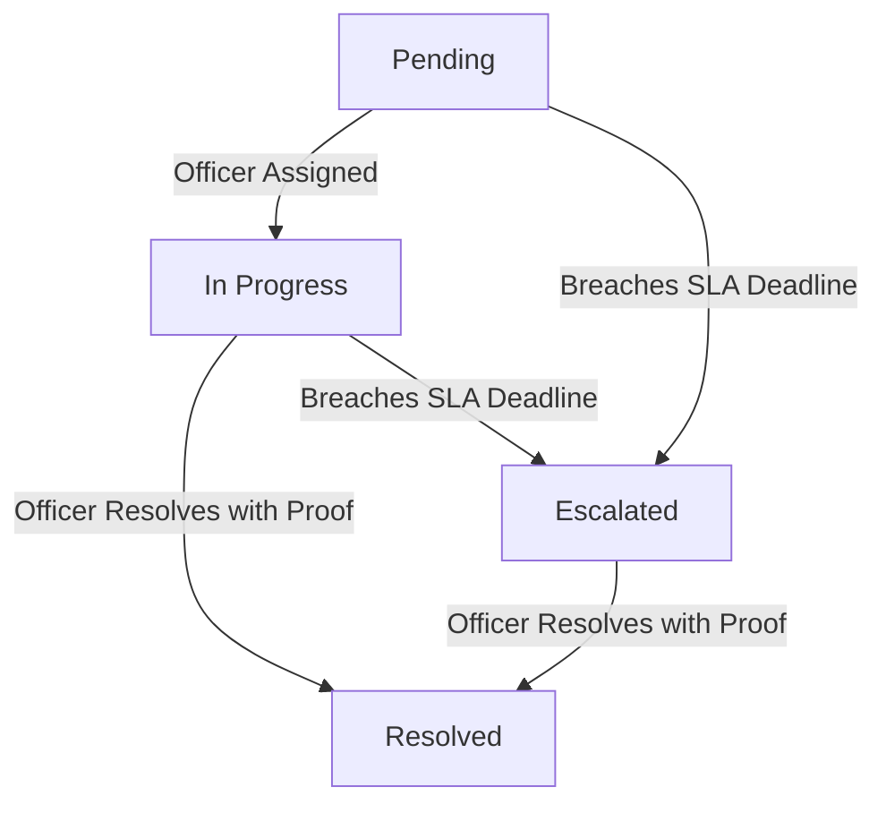

# NagarSeva: Data Privacy & SLA Escalation Policies

This document details the regulatory compliance architecture under the Digital Personal Data Protection (DPDP) Act 2023 and the municipal Service Level Agreement (SLA) escalation workflows implemented in NagarSeva.

---

## Part 1: Data Privacy Policy (DPDP Act 2023 Compliance)

In accordance with the Digital Personal Data Protection Act, 2023, NagarSeva implements a **Privacy by Design** framework. The portal functions as a **Data Fiduciary**, processing citizen data strictly for municipal issue resolution.

### 1. Transparency & Information Notice
Before submitting any complaint, citizens are presented with a bilingual Consent Notice describing:
- **What is collected**: Description of the issue, geolocated coordinates (Latitude & Longitude), ward mapping, and photographic evidence. If logged in, a profile reference ID is logged.
- **Why it is collected**: Strictly to locate, categorize, and resolve the reported civic issue.
- **Who has access**: Internal municipal administrators assigned to the specific ward.

### 2. Citizen Rights (Data Principal Rights)
- **Right to Information**: Citizens can track their complaints using a unique tracking ID and view current statuses.
- **Right to Consent Withdrawal**: Citizens can input their Tracking ID in the [Privacy Center](file:///c:/Users/rajla/OneDrive/Desktop/NSS/src/app/privacy/page.tsx) to withdraw consent. Doing so permanently deletes the description, photo, and location coordinates of the issue.
- **Right to Erasure**: Citizens can request complete account deletion, removing all personal history from the database.

### 3. Data Minimization (Anonymous Submissions)
NagarSeva offers a **Report Anonymously** option. If enabled:
- No personal data (names, phone numbers, email addresses, or user profile associations) is linked to the database record.
- Only technical issue descriptors (photo, ward name, coordinates) are saved to allow resolution crews to locate the site.

### 4. PII Masking on Public Interfaces
The [Public Dashboard](file:///c:/Users/rajla/OneDrive/Desktop/NSS/src/app/dashboard/page.tsx) exposes no Personally Identifiable Information (PII). Reporters' profiles are masked, and only the issue type, status, and ward performance metrics are visualized.

---

## Part 2: Municipal Service Level Agreement (SLA) & Escalation Policy

To prevent complaints from rotting unresolved, NagarSeva implements an automated, category-based SLA time-tracking and escalation engine.

### 1. SLA Time Allocation by Category
SLA limits are configured dynamically based on the urgency and public threat level of the complaint type:

| Category | Typical Issues | SLA Duration | Escalation Triggers |
| :--- | :--- | :--- | :--- |
| **Public Safety & Lights** | Open manholes, broken streetlights, live wiring | **24 Hours (1 Day)** | Exceeds 24 hours without resolution |
| **Sanitation & Waste** | Overflowing garbage bins, carcass removal, sewage | **48 Hours (2 Days)** | Exceeds 48 hours without resolution |
| **Encroachment** | Footpath blockages, illegal vendor parking | **120 Hours (5 Days)** | Exceeds 5 days without resolution |
| **Roads & Potholes** | Cracks, hazardous road potholes | **168 Hours (7 Days)** | Exceeds 7 days without resolution |

### 2. SLA Countdown & State Machine
Every logged complaint follows a structured state progression:

- **SLA Deadline Calculation**: `SLA Deadline = Created Timestamp + SLA Duration`
- **Overdue Indicator**: The admin console computes the remaining time in real-time. If `current_time > sla_deadline` and status is not `Resolved`, the status is flagged as `Escalated` in the UI/database.

### 3. Escalation Hierarchy & Resolution Proofs
When a ticket breaches its SLA, it triggers an automated escalation record:
1. **First-tier Breach (Escalated)**: Ticket details are forwarded to the **Ward Assistant Commissioner**. The console highlights the case as "Breached / Overdue" with red alarms.
2. **Second-tier Breach (+48 Hours Past SLA)**: Ticket details are auto-assigned to the **City Deputy Municipal Commissioner**.
3. **Mandatory Closure Proof**: To transition any complaint (especially In Progress or Escalated) to `Resolved`, the administrator **MUST** upload a photo showing the resolved site (Proof of Work) and write down closure notes. The portal disables the resolve button until this evidence is uploaded.
